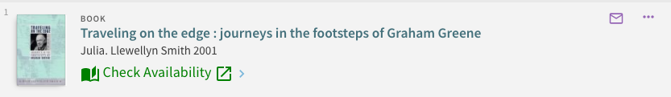
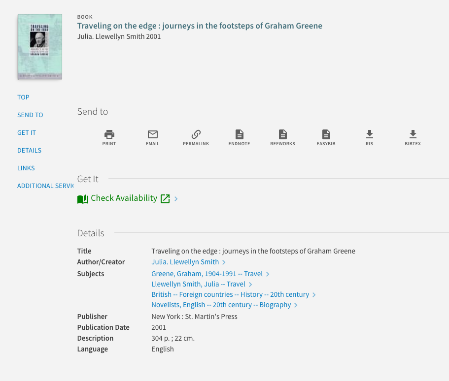

# primo-explore-getit-to-link-resolver

## Description

Override the "availability links" section in brief and full results with a link to your link resolver.

### Screenshot

#### Example 1: In brief results


#### Example 2: In full display


## Installation

1. Assuming you've installed and are using [primo-explore-devenv](https://github.com/ExLibrisGroup/primo-explore-devenv).

2. Navigate to your template/central package root directory. For example:
  ```
  cd primo-explore/custom/MY_VIEW_ID
  ```
3. If you do not already have a package.json file in this directory, create one:
  ```
  npm init -y
  ```
4. Install this package:
  ```
  npm install primo-explore-getit-to-link-resolver --save-dev
  ```

## Usage

Once installed, inject `getitToLinkResolver` as a dependency:

```
let app = angular.module('viewCustom', ['getitToLinkResolver'])
```

**Note:** If you're using the --browserify build option, you will need to first import the module with:

```
import 'primo-explore-getit-to-link-resolver';
```

This will hide all out-of-the-box availability links on the brief and full view.

### In brief results

If you want the link resolver link in the brief results then add the `getit-to-link-resolver-brief` directive to the `prmSearchResultAvailabilityLineAfter` component:

```
app.component('prmSearchResultAvailabilityLineAfter', {
  template: '<getit-to-link-resolver-brief></getit-to-link-resolver-brief>'
})
```

### In full display

If you want the link resolver link in the full display then add the `getit-to-link-resolver-full` directive to the `prmOpacAfter` component:

```
app.component('prmOpacAfter', {
  template: '<getit-to-link-resolver-full></getit-to-link-resolver-full>'
})
```

If you want to fully hide the Get It section in the full display then do not implement the above component and add the following to your css:

```
[aria-label="Get It"],
&[id^='getit_link1_'] {
  display: none;
}
```

### Config

You'll need to configure the module by passing it an object as an angular `constant`:

| name | type | usage |
|------|-------------|--------|
| `linkField` | string | which link template from the record do you want to link to  |
| `linkText` | string | the text for the link |
| `iconBefore` | object | defines the icon for the link to come before the text. must be chosen from <https://material.io/icons/>. you need to specify both the name of the action "set" (see link) and the icon itself, in the form "ic_person_outline_24px". note that all icons do not work so you may have to experiment some |
| `iconAfter` | object | defines the icon for the link to come after the text. see `iconBefore` |

### Example

```
app.constant('getitToLinkResolver', {
  linkField: 'openURL',
  linkText: 'Check Availability',
  iconBefore: {
    set: 'primo-ui',
    icon: 'book-open'
  },
  iconAfter: {
    set: 'primo-ui',
    icon: 'open-in-new'
  }
});
```

### Styles

Finally you'll need to add the following lines to your CSS to stylize the colors:

```
.check-avail-link {
  color: getitColor;
  font-size: 18px;
}
```
